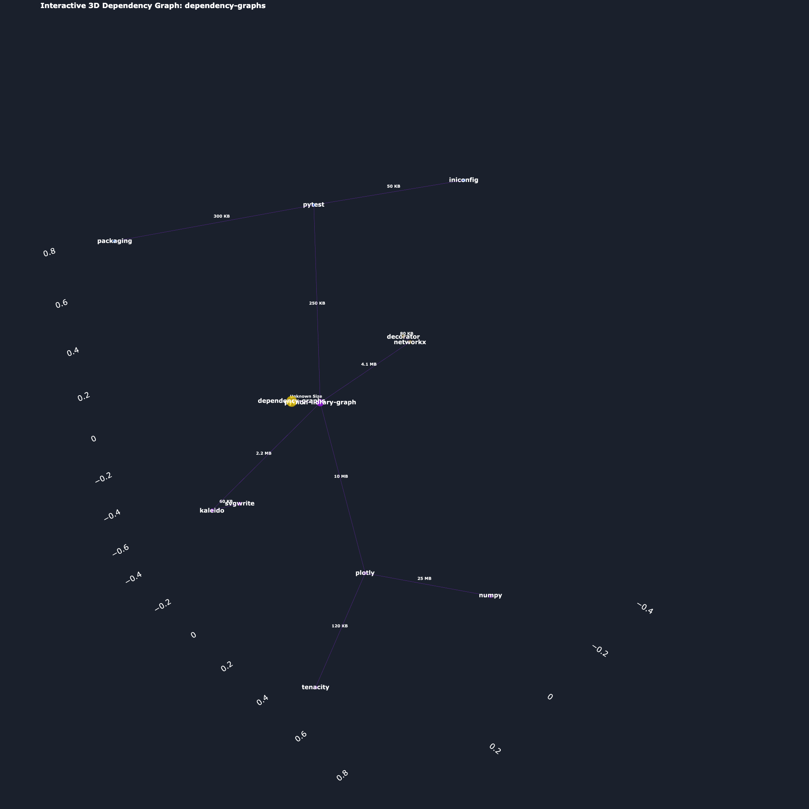

# python-library-graph: 3D Dependency Visualizer

Visualize your Python project's dependencies and analyze their structure with interactive 3D graphs powered by Plotly.

`python-library-graph` is a command-line tool that transforms complex Python dependency networks into intuitive, interactive 3D visualizations. It automatically detects related dependency communities, highlights project relationships, and helps you understand coupling across your environment.

---

## ✨ Features

- **Interactive 3D Visualization**  
  Explore dependency networks using a browser-based interactive Plotly chart.

- **Community Detection**  
  Automatically group related dependencies using the Louvain algorithm for structural insights.

- **Root Highlighting**  
  Clearly mark your project’s root and visually differentiate direct and transitive dependencies.

- **Simple CLI**  
  Generate complete dependency graphs with a single command.

---

## 📦 Installation

You can install **python-library-graph** directly from PyPI (once published - TBD):

---

## 🚀 Usage

Navigate to the root directory of your Python project (the one containing your `requirements.txt` or where dependencies are installed), then run:

---

### Command Options

| Option | Description | Default |
|--------|--------------|----------|
| `--output-html <dependency_graph.html>` | Output the graph as an interactive HTML file. | N/A |
| `--output-image <dependency_graph.png>` | Export the graph as a static image (requires `kaleido`). | N/A |
| `--no-community` | Disable community detection and use depth-based coloring (Direct/Transitive). | Enabled |
| `--version` | Show the version number and exit. | N/A |

---

## 📊 Example Visualization

---

## 📜 License

This project is licensed under the **MIT License**.  
See the `LICENSE` file for details.

---

## 🤝 Contributing

Contributions are welcome!  
Please open an issue or submit a pull request on the GitHub repository.

**Developed by:** *Akash GSS*
